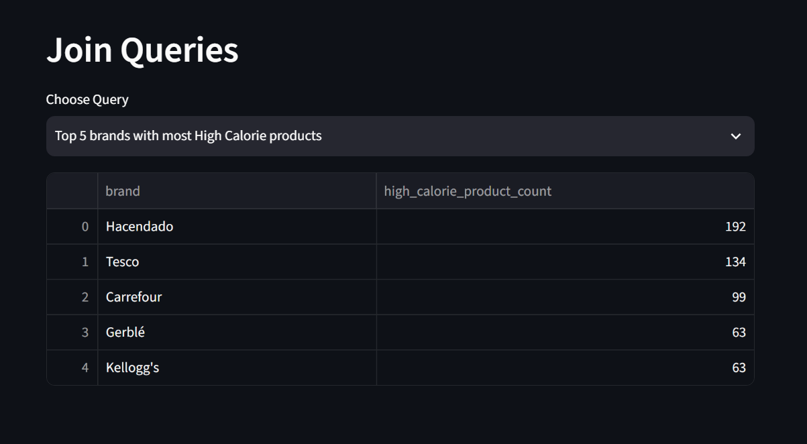
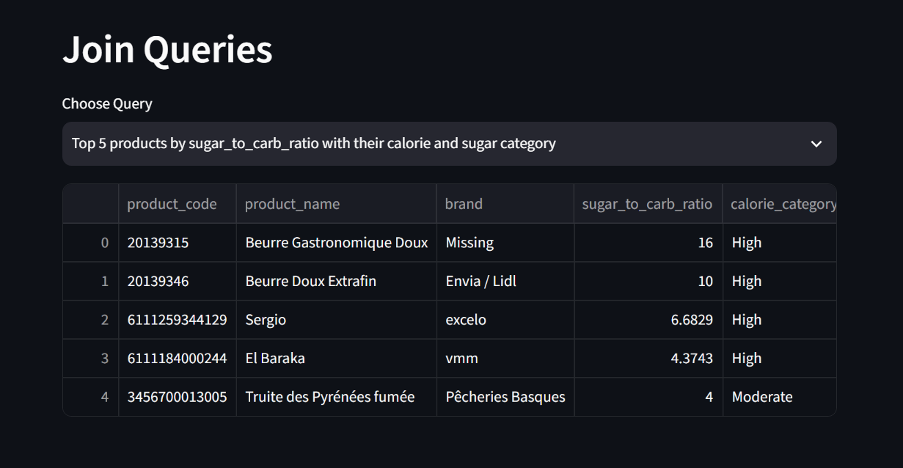
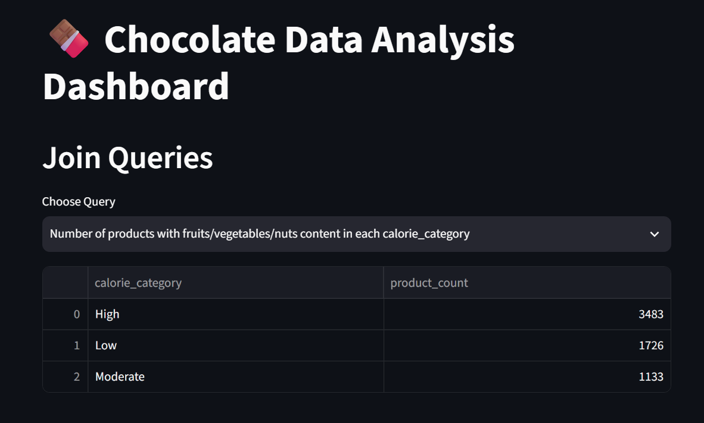

# 🍫 ChocoCrunch Analytics

**ChocoCrunch Analytics** is an end-to-end food product analytics project that transforms raw product and nutritional data into a structured **PostgreSQL database**, performs analytical SQL queries, engineers meaningful nutritional metrics, and delivers the results through an interactive **Streamlit dashboard**.

The project demonstrates a complete data analytics workflow — from **data collection and cleaning to database design, feature engineering, SQL analysis, EDA, and dashboard development**.

---

## 📊 Dashboard Preview



### SQL Analysis





---

## 🎯 Project Objectives

* Collect and prepare food product data for analysis.
* Clean and transform raw nutritional and product information.
* Design a relational database using PostgreSQL.
* Separate product, nutritional, and derived analytical attributes.
* Engineer nutritional and product-processing metrics.
* Perform **27 analytical SQL queries**.
* Demonstrate SQL aggregations, filtering, grouping, and multi-table JOINs.
* Perform exploratory data analysis using Python and Matplotlib.
* Build an interactive Streamlit application for data exploration and SQL analysis.
* Apply secure environment-variable management for database credentials.

---

## 🛠️ Technology Stack

| Technology           | Purpose                                     |
| -------------------- | ------------------------------------------- |
| **Python**           | Data processing and application development |
| **Pandas**           | Data cleaning and transformation            |
| **NumPy**            | Numerical operations                        |
| **PostgreSQL**       | Relational database                         |
| **SQL**              | Data analysis and business queries          |
| **Streamlit**        | Interactive analytics dashboard             |
| **Matplotlib**       | Data visualization                          |
| **python-dotenv**    | Environment variable management             |
| **Jupyter Notebook** | Data preparation and analysis               |
| **Git & GitHub**     | Version control and project management      |

---

# 🗄️ Database Design

The project organizes the processed data into three analytical tables.

### `product_info`

Contains product-level information:

* `product_code`
* `product_name`
* `brand`

### `nutrient_info`

Contains nutritional and product-classification attributes:

* `energy_kcal_value`
* `sugars_value`
* `carbohydrates_value`
* `fat_value`
* `sodium_value`
* `nova_group`
* fruits/vegetables/nuts content

### `derived_metrics`

Contains engineered analytical features:

* `calorie_category`
* `sugar_category`
* `sugar_to_carb_ratio`
* `is_ultra_processed`

### Table Relationship

```text
                 product_info
                      │
                product_code
                      │
                      ▼
                nutrient_info
                      │
                product_code
                      │
                      ▼
                derived_metrics
```

This structure allows the project to demonstrate both **table-level analysis and relational JOIN operations**.

---

# 🧹 Data Preparation

The data preparation workflow includes:

1. Loading the raw product dataset.
2. Exploring the dataset structure and completeness.
3. Cleaning product and nutritional attributes.
4. Handling missing values.
5. Standardizing product and brand information.
6. Preparing numerical nutritional variables.
7. Creating derived nutritional metrics.
8. Preparing data for PostgreSQL.
9. Validating the final database tables.

---

# ⚙️ Feature Engineering

Several derived metrics were created to make the dataset more useful for analysis.

### Calorie Category

Products are classified into calorie-based categories to support comparative nutritional analysis.

### Sugar Category

Products are categorized based on their sugar content.

### Sugar-to-Carbohydrate Ratio

```text
sugar_to_carb_ratio =
sugars_value / carbohydrates_value
```

This metric helps identify products where sugar represents a relatively large proportion of total carbohydrates.

### Ultra-Processed Classification

Products are categorized based on their processing classification, enabling analysis of ultra-processed products across brands and calorie categories.

---

# 📑 SQL Analysis

The project contains **27 analytical SQL queries** organized into four categories.

## `product_info`

1. Count products per brand
2. Count unique products per brand
3. Identify the top 5 brands by product count
4. Find products with missing product names
5. Count unique brands
6. Find products with codes starting with `3`

## `nutrient_info`

7. Find the top 10 products with the highest calorie values
8. Calculate average sugar content per NOVA group
9. Count products with fat greater than 20g
10. Calculate average carbohydrate content
11. Find products with sodium greater than 1g
12. Count products with non-zero fruits/vegetables/nuts content
13. Find products with more than 500 kcal

## `derived_metrics`

14. Count products per calorie category
15. Count High Sugar products
16. Calculate average sugar-to-carbohydrate ratio for High Calorie products
17. Find products that are both High Calorie and High Sugar
18. Count ultra-processed products
19. Find products with a sugar-to-carbohydrate ratio greater than `0.7`
20. Calculate average sugar-to-carbohydrate ratio per calorie category

## JOIN Queries

21. Find the top 5 brands with the most High Calorie products
22. Calculate average energy value for each calorie category
23. Count ultra-processed products per brand
24. Find High Sugar and High Calorie products along with their brands
25. Calculate average sugar content per brand for ultra-processed products
26. Count products with fruits/vegetables/nuts content in each calorie category
27. Find the top 5 products by sugar-to-carbohydrate ratio with their calorie and sugar categories

---

# 📊 Exploratory Data Analysis

The Streamlit application provides interactive EDA covering:

### Distribution Analysis

* Energy / calorie distribution
* Sugar distribution
* Carbohydrate distribution
* Sugar-to-carbohydrate ratio

### Category Analysis

* Calorie categories
* Sugar categories
* NOVA groups

### Product Processing Analysis

* Ultra-processed products
* Other processing categories

### Relationship Analysis

* Calories vs. sugar
* Energy vs. NOVA group

These visualizations help identify nutritional patterns and relationships across the product dataset.

---

# 🖥️ Streamlit Application

The Streamlit dashboard provides an interactive interface for exploring the PostgreSQL database.

### Features

* SQL query selection
* Interactive query results
* Product-level analysis
* Brand-level analysis
* Multi-table JOIN analysis
* Nutritional analysis
* EDA visualizations
* Database-backed analytics

The dashboard retrieves analytical results directly from PostgreSQL rather than relying solely on static pre-generated results.

---

# 📁 Project Structure

```text
ChocoCrunch-Analytics/
│
├── app.py
├── README.md
├── requirements.txt
├── .gitignore
├── .env.example
│
├── Dataset Collection.ipynb
├── Data Exploration and Cleaning.ipynb
├── Feature Engineering.ipynb
├── Exploratory Data Analysis.ipynb
├── SQL Queries.ipynb
├── SQL Table Design.ipynb
│
├── screenshots/
│   ├── dashboard.png
│   ├── join-queries-ratio.png
│   └── join-queries-brands.png
│
└── data/
    └── ...
```

> `.env`, `.venv/`, and other sensitive or environment-specific files are excluded from version control using `.gitignore`.

---

# 🔐 Environment Configuration

Database credentials are stored locally using environment variables.

Create a `.env` file in the project root:

```env
DB_HOST=localhost
DB_PORT=5432
DB_NAME=CHOCO_CRUNCH
DB_USER=postgres
DB_PASSWORD=your_password_here
```

A safe `.env.example` can be provided in the repository:

```env
DB_HOST=localhost
DB_PORT=5432
DB_NAME=CHOCO_CRUNCH
DB_USER=postgres
DB_PASSWORD=your_password_here
```

**Never commit the actual `.env` file or database credentials to GitHub.**

---

# 🚀 Installation & Setup

## 1. Clone the repository

```bash
git clone https://github.com/SARAVANAN-2410/ChocoCrunch-Analytics.git
cd ChocoCrunch-Analytics
```

## 2. Create a virtual environment

```bash
python -m venv .venv
```

## 3. Activate the virtual environment

### Windows

```bash
.venv\Scripts\activate
```

### macOS / Linux

```bash
source .venv/bin/activate
```

## 4. Install dependencies

```bash
pip install -r requirements.txt
```

## 5. Configure PostgreSQL

Create the required PostgreSQL database:

```text
CHOCO_CRUNCH
```

Create and populate the required tables using the SQL table-design notebook.

## 6. Configure environment variables

Create `.env`:

```env
DB_HOST=localhost
DB_PORT=5432
DB_NAME=CHOCO_CRUNCH
DB_USER=postgres
DB_PASSWORD=your_password_here
```

## 7. Run the Streamlit application

```bash
python -m streamlit run app.py
```

The application will open in your browser.

---

# 🔄 Project Workflow

```text
Raw Product Data
       │
       ▼
Data Collection
       │
       ▼
Data Exploration & Cleaning
       │
       ▼
Feature Engineering
       │
       ▼
PostgreSQL Database
       │
       ├───────────────┐
       ▼               ▼
SQL Analysis          EDA
       │               │
       └───────┬───────┘
               ▼
       Streamlit Dashboard
               │
               ▼
      Interactive Insights
```

---

# 📌 Key Skills Demonstrated

* Python
* PostgreSQL
* SQL
* Data Cleaning
* Data Transformation
* Feature Engineering
* Exploratory Data Analysis
* Relational Database Design
* SQL Aggregations
* SQL JOINs
* Data Visualization
* Pandas
* NumPy
* Streamlit
* Jupyter Notebook
* Environment Variable Management
* Git & GitHub

---

# 💼 Portfolio Value

This project demonstrates practical experience across multiple stages of a data analytics workflow:

**Data → Cleaning → Feature Engineering → Database → SQL → EDA → Application**

It particularly demonstrates the ability to work with **relational databases, analytical SQL, Python-based data processing, and interactive data applications** in a single project.

---

## 👨‍💻 Author

### Saravanan M

**Data Science & Python Enthusiast**


GitHub: [SARAVANAN-2410](https://github.com/SARAVANAN-2410)

---

## ⭐ Project

If you find this project useful, consider giving the repository a ⭐ on GitHub.
